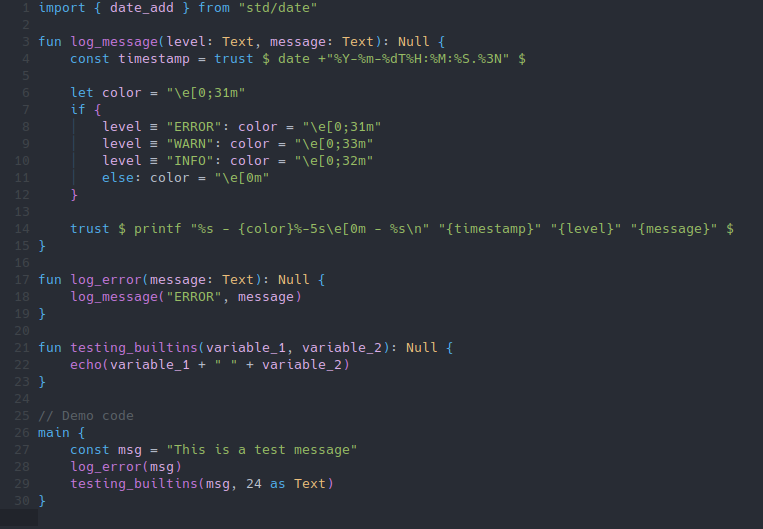

#+title: Amber-mode
#+author: Georgios Davakos
#+language: en

An Emacs major-mode for syntax highlighting and automatic indentation when working with the [[https://amber-lang.com/][Amber programming language]]. Requires Emacs 26.1 or later.

** Installation
*** MELPA
The package is available on [[https://melpa.org/#/getting-started][MELPA]]. Add this to your init.el.

#+begin_src emacs-lisp
(use-package amber-mode)
#+end_src

** Features
As of the time of writing, ~amber-mode~ can do the following:
- Syntax highlighting
- Automatic indentation

*** Examples
#+CAPTION: Syntax highlighting example
#+NAME: syntax-highlighting

